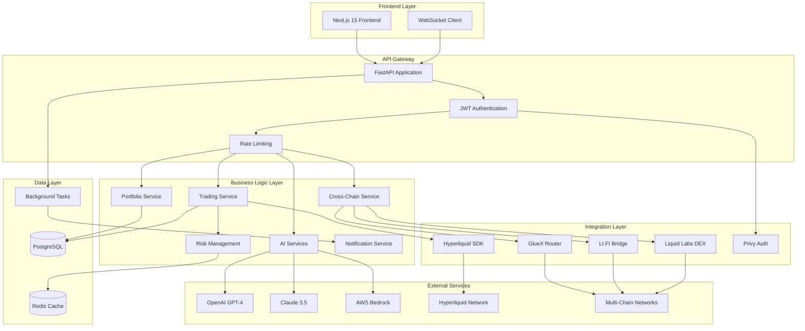
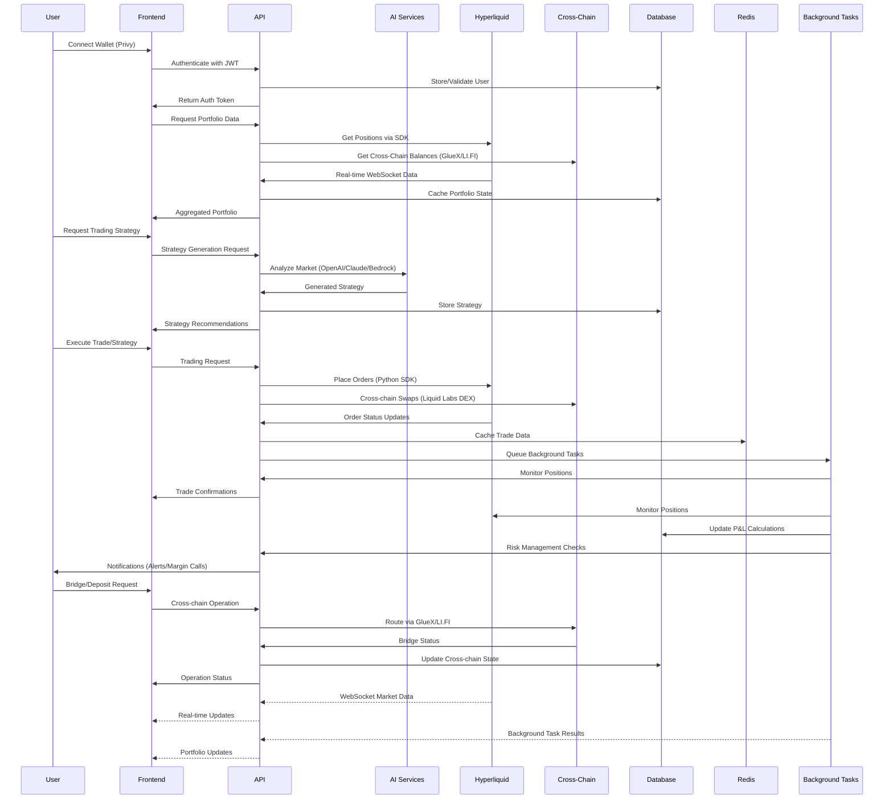

# Nadas

Hyperliquid-native DeFi Automation Platform backend service. This platform is designed for AI-powered trading automation, cross-chain operations, and portfolio management.

## Features [](https://deepwiki.com/Nadasfi/nadas)

- **AI-Powered Trading**: Automated strategy generation with Claude 3.5 Sonnet and AWS Bedrock integration
- **Hyperliquid Integration**: Native Python SDK with real trading capabilities, HyperEVM precompiles support, and EIP-712 transaction signing
- **Cross-Chain Orchestrator**: AI-powered cross-chain strategy management with portfolio aggregation
- **Portfolio Management**: Real-time position tracking, P&L calculations, and risk management
- **Automation Engine**: User wallet delegation, sub-account automation, and DCA strategies
- **WebSocket API**: Real-time data streaming for live market updates
- **Transaction Simulator**: HyperEVM transaction simulation with advanced features

## Key Integrations

### GlueX Router Integration
- **Cross-Chain Deposits**: Support for Ethereum, Arbitrum, Polygon, and Base networks
- **Portfolio Aggregation**: USD value calculation across all supported chains
- **Optimal Routing**: MEV protection and slippage minimization
- **Real API Integration**: Production-ready connection to router.gluex.xyz/v1

### Liquid Labs Integration
- **LiquidSwap DEX Aggregator**: 14-DEX routing including KittenSwap, HyperSwap, Laminar, Valantis, and more
- **Multi-hop Optimization**: Best execution across all HyperEVM DEXes
- **Revenue Sharing**: Custom fees + 50% positive slippage capture
- **LiquidLaunch Token Platform**: Bonding curve mechanics and fair launch protection

### LI.FI Cross-Chain Integration
- **Bridge Aggregation**: Optimal routing across multiple bridge providers
- **Slippage Protection**: Advanced slippage management and MEV protection
- **Real-time Quotes**: Live pricing and execution estimates

### Notification System
- **Portfolio Monitoring**: Real-time alerts for P&L thresholds and margin calls
- **Price Alerts**: Customizable price targets and market condition notifications
- **Multi-channel Delivery**: In-app, email, push, and WebSocket notifications
- **Node Info API Integration**: Hyperliquid-specific monitoring and alerts

## Architecture

### Service Architecture


## Technologies

- **Framework**: FastAPI with async/await patterns
- **Database**: PostgreSQL with SQLAlchemy ORM and Alembic migrations
- **Cache**: Redis for session management and background job processing
- **Background Tasks**: Celery for automation and monitoring tasks
- **AI Providers**: OpenAI GPT-4, Anthropic Claude 3.5 Sonnet, AWS Bedrock
- **Blockchain**: Hyperliquid Python SDK, Web3.py, HyperEVM precompiles
- **Cross-Chain**: GlueX Router, LI.FI, Liquid Labs, Privy authentication
- **Monitoring**: Structured logging with structlog and comprehensive error handling

## Key Integrations

### Hyperliquid Ecosystem
- **Real Trading**: Live order placement, position management, and portfolio tracking
- **HyperEVM Support**: Read precompiles for on-chain data and CoreWriter contract integration
- **WebSocket Streams**: Real-time market data and user state updates
- **EIP-712 Signing**: Production-ready wallet integration and transaction signing

### AI-Powered Features
- **Market Analysis**: AI-driven insights and trading strategy recommendations
- **Automation Logic**: Intelligent DCA, rebalancing, and liquidation monitoring
- **Risk Management**: AI-powered position sizing and portfolio optimization
- **Cross-Chain Strategies**: Automated arbitrage and yield optimization across networks

### Security & Reliability
- **Circuit Breakers**: Protection against external API failures
- **Rate Limiting**: Intelligent request throttling and retry mechanisms
- **Error Tracking**: Comprehensive error monitoring and recovery
- **Authentication**: JWT-based security with Privy Web3 wallet integration

## Development Status

**Phase 1: Core Platform (100% Complete)**
- Full-stack architecture with FastAPI + Next.js 15
- Production database with comprehensive models
- Authentication system with Privy integration
- Complete API documentation and OpenAPI specs

**Phase 2: Hyperliquid Integration (100% Complete)**
- Real Hyperliquid Python SDK integration
- Live trading capabilities and position management
- Real-time market data and WebSocket streams
- EIP-712 wallet authentication and transaction signing

**Phase 3: External Integrations (100% Complete)**
- GlueX Router integration - Cross-chain deposits
- Liquid Labs integration - DEX aggregation + token launching
- LI.FI integration - Bridge aggregation and routing

## Getting Started

### Quick Start
```bash
# Clone repository
git clone https://github.com/nadasfi/nadas.git
cd nadas

# Install dependencies
pip install -r requirements.txt

# Set environment variables
cp .env.example .env
# Configure your API keys and database settings

# Run migrations
alembic upgrade head

# Start development server
uvicorn app.main:app --reload
```

### Docker Deployment
```bash
# Development
docker-compose up -d

# Production
docker-compose -f docker-compose.production.yml up -d
```

## System Flow Diagram


